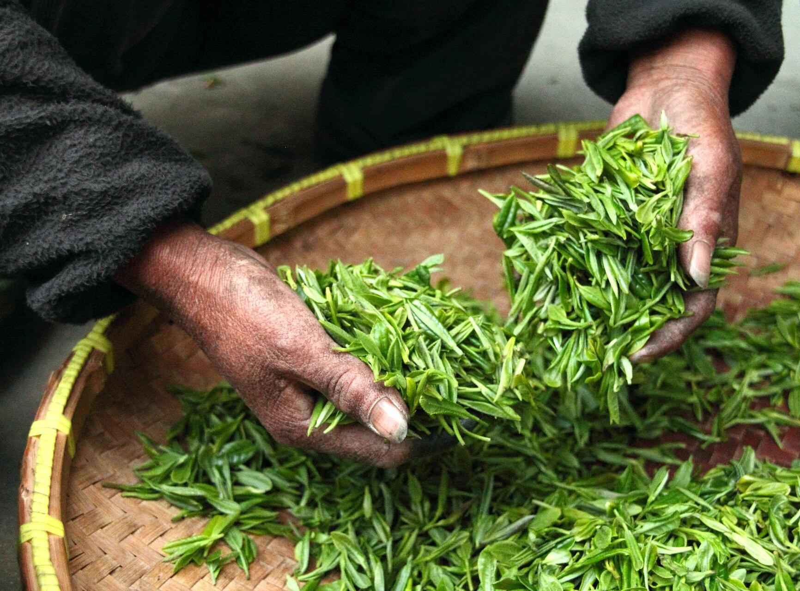
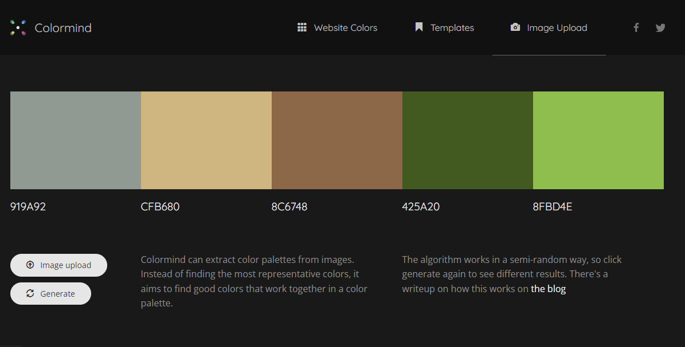
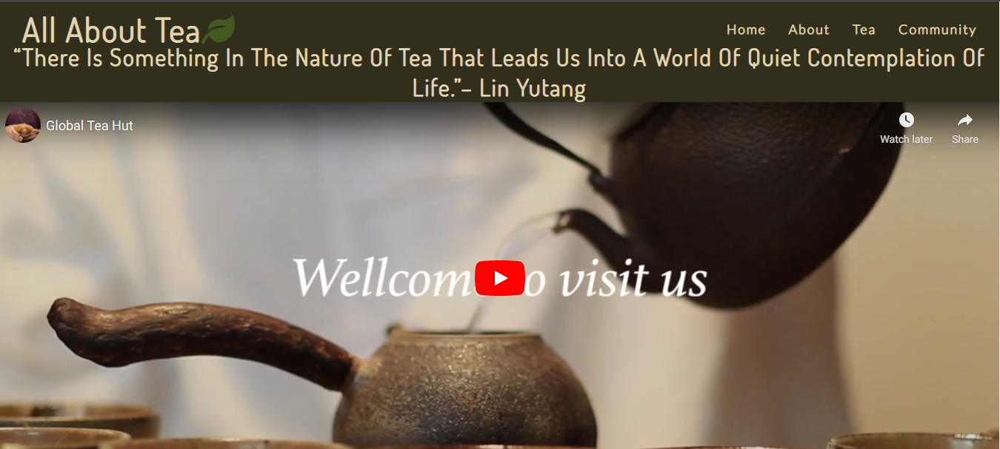
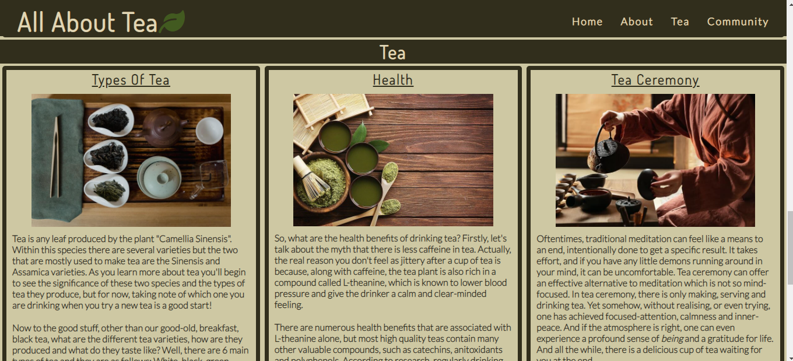
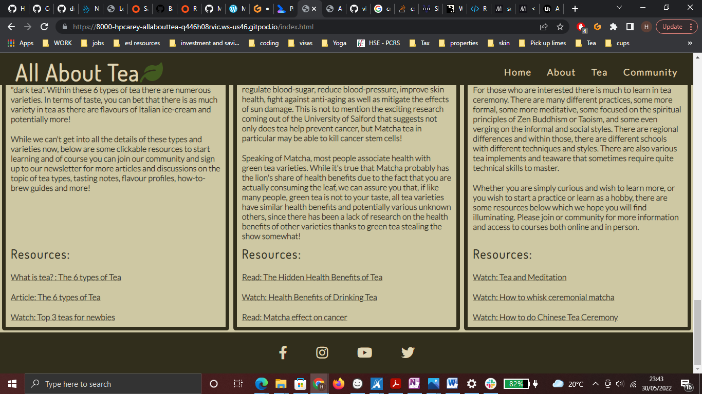
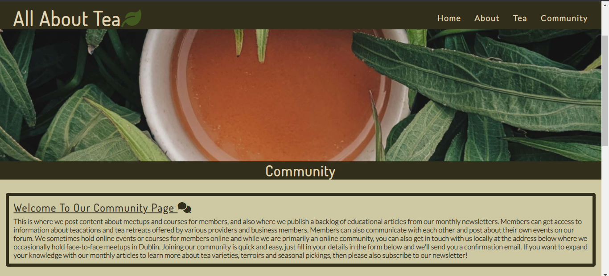
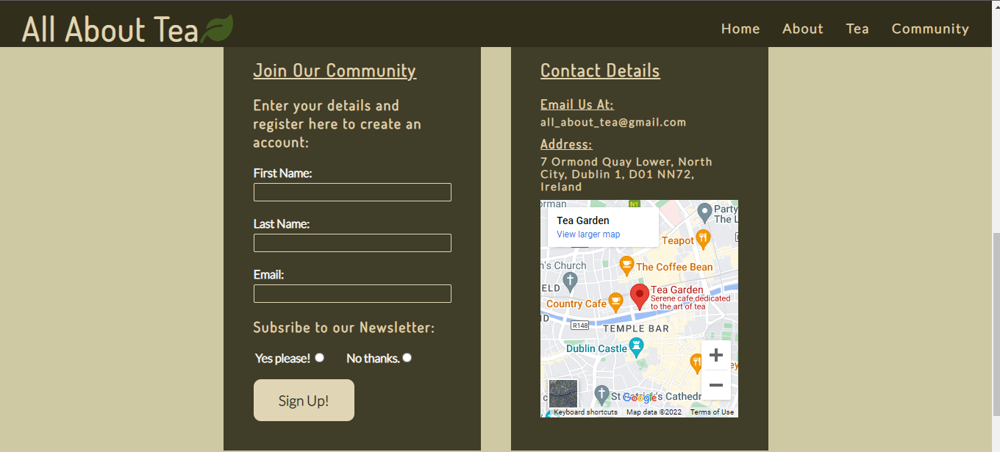
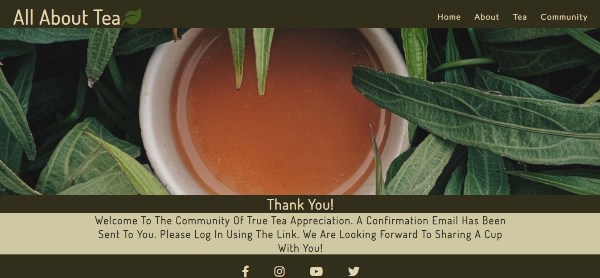

# All About Tea
Visit the live website [here](https://8000-hpcarey-allabouttea-wwmcndnrf4o.ws-us45.gitpod.io/)
## Site-Overview
All About Tea is a website dedicated to spreading information and education about tea and tea culture. It's purpose is to help popularise higher quality and healthier tea products, grown by small farmers and indigineous people, as well as to promote the more ceremonial and mindful tea practices that exist in eastern tea cultures, but which haven't quite taken off in the west yet. With meditation and mindfulness movements becoming more and more prominent in western society, All About Tea hopes to be one of the pioneering sources of the "Tea Movement" in the English speaking world. It's more immediate aim is to educate users and to build an online community around this somewhat niche hobby.

## Planning Stage

### Intended Users
The website is intended for a variety of users:
* Those who already have some knowledge and interest in tea and who wish to learn more and become involved in a global, online community who share the same interest.
* Beginners or "newbies" who have a curiosity and a desire to learn more about tea and tea culture, but who haven't yet developed this interest in a practical way.
* Those who are interested in higher quality tea for health reasons.
* Those who are looking for a meditative/mindful practice who have problems focusing and sitting in traditional meditation.

### User Stories
* As a visiting user, I want a quick, general intorduction to the topics.
* As a user, I want to be able to easily navigate to the section with the information I am seeking.
* As a user, I want to have learned something about the topic for which I visited the website.
* As a user, I want to be given navigation links to other resources that go more in depth on the topic that interests me most.
* As a user, I want the opportunity to connect with like-minded people and to become part of a community.

### Site aims
 1. The website will give users a general intorduction to tea related topics and will provide links to external sources and other websites for further education on each specific topic.   

2. The site will promote Tea Culture and encourage users to explore all aspects of tea, from the physical health benefits, to the meditative and ceremonial qualities as well as the taste experience of different varieties of tea.

3. The site will offer users the opportunity to become members and recieve monthly educational articles and updates of events and meetup opportunites (both online and face to face events) around the world. 

### Wireframes:
Although I know it was not a requirement, I used wireframes to help me visualise and conceptualise the features and layout of the website and it really helped me to create a solid image in my mind of how the webiste would function and look. It was also really useful in terms of getting feedback from my mentor on what would work and what wouldn't.

See [Wireframes.](docs/README-images/wireframes.pdf)

### Imagery
The images are a really important aspect of the site because they really help to set the tone and are a strong influence on the colour scheme which features earhty brown and green tones. 
* Images were taken from 
    * [Pixabay](https://pixabay.com)
    * [Unsplash](https://unsplash.com)
    * [Pexels](https://www.pexels.com)

* Images were formatted according to [this](https://www.jimdo.com/blog/optimize-website-images-for-better-design-seo/) article which is mentioned in the credits.

### Colour Scheme and Accessibility
 The first step for creating the colour scheme was to uplaod the hero image to [colormind](http://colormind.io/image/) and generate a few different palettes and copy the hex values.

 The next step was to go to input these hex values into the contrast grid on [Eightshapes](https://contrast-grid.eightshapes.com/) to check the WCAG 2.0 minimum contrast scores which helped me to pick a background and foreground colour that meet the accessibility requirements for good UX.

 

 

 

 ### Typogrophy

 The first step for choosing the font was to got to [google fonts](https://fonts.google.com/) and type my website title to see which font had the style I was going for. I wanted something simple and with soft edges, so I ended up choosing Dosis.
 
Next I did a quick google search to see which fonts were commonly paired with Dosis.

 Finally, I used [pairfonts](https://pairfonts.com/) to decide which font I wanted to pair with it. I chose lato and with the intention of experimenting between regular and italicized. The clean lines and simplicity matched Dosis well and was the style I was going for with my website.

 ### Layout
 * The main content is on a single web page containging multiple sections which is the most appropriate for an information-based site
 * There are 2 other pages:
      * The Community page which provides information about the community, a sign up form and contact information, accessible via the navigation menu.
      * A form validation page which displays a thank you message upon correct form completion.
 

## Features
### Existing features
#### Navigation bar
* The navigation bar is featured on all pages of the site. 
* As much of the site is a single page the nav bar is sticky to aid navigation and I tried to make it as thin as possible so it doesn't interfere with the content too much.
* The nav bar is fully responsive and links to the Home, About, Tea and Community sections. 
* The Validation page can only be accessed once the form on the Community section has been filled in and submitted with the correct input type. 

#### Logo
The logo also acts as a link to the homepage and is made up of the site name. It is part of the navigation bar and so is always on the screen as the navbar is sticky. 

#### Footer 
* The footer is fully reposive and features at the bottom of each individual webpage.
* The footer contains external links to social media.
* All social media links open in a new tab and contain aria-labels for accessability.

#### Landing page
* The landing page features the hero image of a farmer's hand sifting through freshly picked tea leaves, which sets the tone and gives the user an idea of the kind of content the site provides. There is a zoom effect as seen in the Love Running walkthrough project.
* There is also a text overlay on the hero image giving a brief site overview and  inviting users to explore.

#### About section
The About section goes into more detail introducing the site to users and explaining what type of information and resources they will find.
*  The section begins with a tea mindfulness quote and then scrolls down to an embedded video again promoting tea mindfulness.

  * The main content is a short introduction to the 3 aspects of tea featured on the site and what kind of information to expect under each heading. 
  * The heading are also internal links to the part of the site related to that specific content. They have a hover feature to allow users to identify that they are links. This is more useful for the mobile and small screen structure as the content is divided put a bit more and there is a lot more scrolling involved. 
  

#### Tea
* This section contains the main content of the site and is divided into three parts; 

     * Tea varieties
     * Tea ceremony
     * Health
     

* Each part has a heading, an image and some text about the topic. Beneath the text are some links to external resources, such as articles and videos, related to the topic.
* The external links all open in a new tab, and like the internal links in the above "about" section, there is a hover feature where they change color and size to help users identify them as links.
* aria-labels have been used to explain wha the link is and that it will open a new tab for users using a screen reader. 

#### Community
* This section contains a second hero image as a background image to convey more clearly to the user that they have left the main page of the site and are on a new page.
*  Beneath there is a heading with a paragraph explaining about the community and how to get involved. 

* There is form where users can become members to get accesss to past articles and newsletter as well as to the online All About Tea community chat and message board. 
    * The form contains 3 input fields for first name, last name and email address, which are required for form validation.

    * Within the form, users have the option to  subscribe to the monthly newsletter to receive news about tea production and sales, as well as events and featured articles. This is also a required field in the form of 2 radio buttons.

    * Lastly there is a submit button that will only validate the submission if all required fields have been filled in using the correct input type.

    * The user is taken to a validation page upon completing the form which has been set up using action="validation.html. No data is actually being collected.

* There is also a Contact section featuring an email, phone number and address for the base of operations in Dublin, as well as an embedded google maps location.  

#### Validation page
* This page displays a "Thank You" message once users have signed up to become members. 
* It features the same hero image as the community page for consistency and to show the link between the two pages.
* Originally I was going to repeat some of the content from the community page and perhaps add an image, but in the end I liked the simplicity of the thank you message and repeating information from other pages seemed a bit redundant.

### Features left to implement
* As this is a community page and as suggested in the Community section, one of the features of this site would be a message board and live chat feature.

 * As the community grows, there would also be an events page where members and businesses could promote their tea events and meetups.

* There is also potential for a products page where member and non-member users could purchase tea and teaware. 

## Technology
### Languages 
* HTML
* CSS
### Frameworks and Libraries
* [Font awesome](https://fontawesome.com/)
* [Pairfonts](https://pairfonts.com/)
* [Google fonts](https://fonts.google.com/)
* [Balsamiq](https://balsamiq.com/wireframes/)
* [Github](https://github.com/)
* [Gitpod](https://gitpod.io/)
* [Tiny PNG](https://tinypng.com/)
* [Pixabay](https://pixabay.com)
* [Unsplash](https://unsplash.com)
* [Pexels](https://www.pexels.com)
* [Eightshapes](https://contrast-grid.eightshapes.com/)
* [Colour Palette](docs/README-images/colour-palette.png)
* [rgbacolorpicker](https://rgbacolorpicker.com/hex-to-rgba)
* [Am I responsive](https://ui.dev/amiresponsive)

## Testing
  8.1 code validation
  8.2 test cases (user story based with screenshots)
  8.3 fixed bugs
  8.4 supported screens and 
  
### User Stories
* As a visiting user, I want a quick, general intorduction to the topics.
* As a user, I want to be able to easily navigate to the section with the information I am seeking.
* As a user, I want to have learned something about the topic for which I visited the website.
* As a user, I want to be given navigation links to other resources that go more in depth on the topic that interests me most.
* As a user, I want the opportunity to connect with like-minded people and to become part of a community.

## Deployment 
9.1 via gitpod 

9.2 via github pages
## Credit
Sticky Nav how to: [w3schools](https://www.w3schools.com/howto/howto_js_navbar_sticky.asp)

How to align items in flexbox (This helped me solve several alignment issues with flex content including how to center the images in a display flex container a): [MDN](https://developer.mozilla.org/en-US/docs/Web/CSS/CSS_Flexible_Box_Layout/Aligning_Items_in_a_Flex_Container)

How to push items to the bottom of the page with margin: 0 auto; [culture foundry](https://www.culturefoundry.com/cultivate/technology/bottom-align-an-element-with-flexbox/)

 How to get flex items to wrap after making them display: flex; flex: 1; for equal width: [Stack Overflow](https://stackoverflow.com/questions/44135352/flex-wrap-is-not-wrapping-when-i-reduce-the-window-size)

 How to make your flex items the same width : [Stack Overflow](https://stackoverflow.com/questions/29503227/how-to-make-flexbox-items-the-same-size) 
 [Tutorial](https://www.google.com/search?q=how+do+you+make+your+flex+items+the+same+size&oq=how+do+you+make+your+flex+items+the+same+&aqs=chrome.1.69i57j33i160l4.17209j0j7&sourceid=chrome&ie=UTF-8#kpvalbx=_O9WRYuqNDuKWseMPnbe74Ag18)

 How to introduce smooth transition for hover features [iqcode.com]( https://iqcode.com/code/css/css-text-larger-on-hover*/)

how to use :active pseudo class : [W3schools](https://www.w3schools.com/cssref/sel_active.asp)

[Flex box tutorial](https://www.youtube.com/watch?v=JJSoEo8JSnc)

[Flex box and grid](https://www.youtube.com/watch?v=R7gqJkdc5dM)

[flexbox navbar](https://www.youtube.com/watch?v=yXhfUCXy2j4&ab_channel=WhatMakeArt)

### Articles
[Jimdo](https://www.jimdo.com/blog/optimize-website-images-for-better-design-seo/): Article on how to prepare images for assets folder